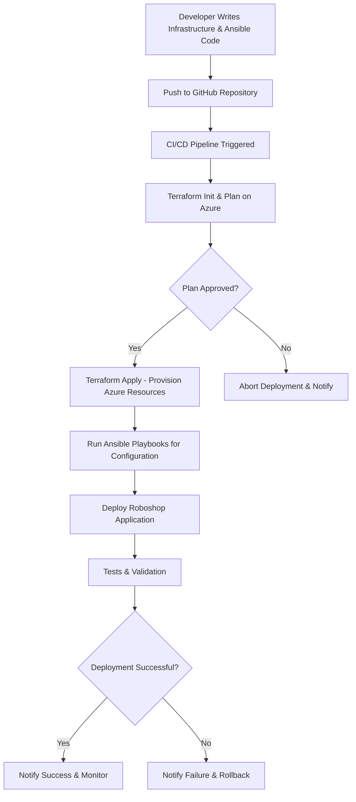

# Azure-Ansiblecode-Terraform-Roboshop
# ☁️🚀 Azure-Ansiblecode-Terraform-Roboshop 🎯🛠️


---

## 🌟 About This Project

Welcome to **Azure-Ansiblecode-Terraform-Roboshop**!  
This repository is a vibrant playground combining the power of 🌐 **Azure Cloud**, 🛠️ **Ansible automation**, and ⛏️ **Terraform Infrastructure as Code** to build and deploy Roboshop applications seamlessly. This project streamlines cloud automation workflows to boost your DevOps game! 🚀🤖

---

## ✨ Features & Highlights

- 🔄 Fully automated provisioning with **Terraform**  
- 📦 Configuration management using **Ansible**  
- ☁️ Targeted for Microsoft **Azure Cloud** Infrastructure  
- 🎯 Robust Makefile-driven automation tasks  
- 🧩 Modular and reusable scripts for easy customization  
- ⚡️ Fast, scalable, and production-ready deployment patterns  

---

## 🚀 Quick Start Guide
clone this repo
```git clone https://github.com/nischiashok/Azure-Ansiblecode-Terraform-Roboshop.git```

Enter the project directory
```cd Azure-Ansiblecode-Terraform-Roboshop```

View available Makefile targets
```make help```

Run core automation tasks (example)
```make deploy```

> Customize the Terraform & Ansible playbooks as per your project needs, then automate deployments with simple make commands! 🎉

---

## 🗂 Repository Structure

| Folder/File  | Description                                |
|--------------|--------------------------------------------|
| `Makefile`   | Comprehensive automation task runner       |
| `terraform/` | Contains Terraform configurations           |
| `ansible/`   | Ansible playbooks and roles                  |
| `docs/`      | Documentation and guides                     |

---

## 🎯 Who Should Use This?

- 💻 DevOps engineers aiming for Azure cloud mastery  
- 🔧 Automation enthusiasts who love Ansible and Terraform  
- 🚀 Developers deploying Roboshop microservices projects  
- 📚 Learners preparing for cloud infrastructure certifications  

---

## ❤️ Contribution & Support

Contributions, issues, and feature requests are welcome!  
Please open an issue or submit a pull request to contribute. 🙌

---

## 📜 License

This project is licensed under the **MIT License** - see the [LICENSE](LICENSE) file for details.

---

## 📬 Connect & Stay Updated

For questions or feedback, please reach out via GitHub issues or discussions.  
Keep an eye on this repo for exciting updates and improvements! 🌟

---

# 🥳 Thanks for visiting Azure-Ansiblecode-Terraform-Roboshop!  
Build. Automate. Innovate. 🚀

